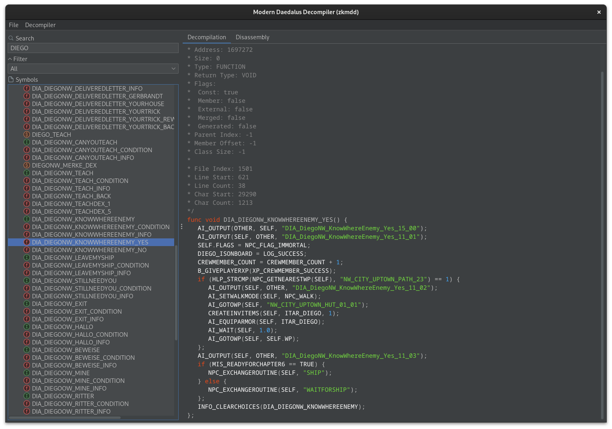
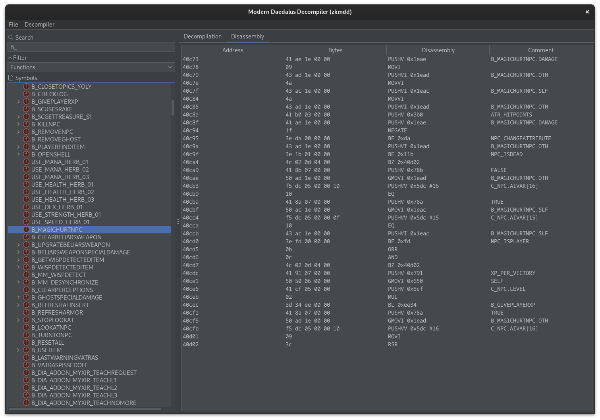
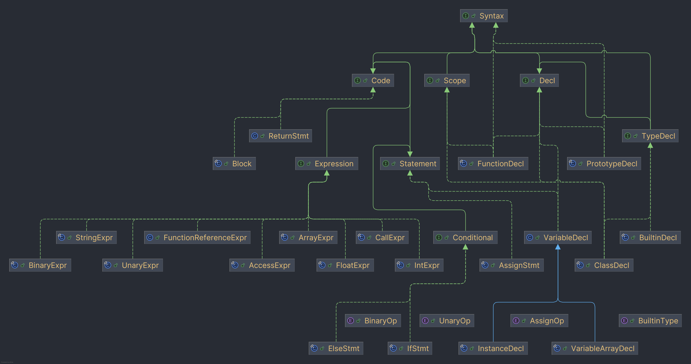

# `mdd` — The Modern Daedalus Decompiler

|  |  |
|---------------------------------|-----------------------------------|

`mdd` is a visual decompiler and disassembler for compiled *Daedalus* scripts used by the *ZenGin*, an early-2000s game engine made by [Piranha Bytes](https://en.wikipedia.org/wiki/Piranha_Bytes) for their open-world role-playing games [Gothic](https://en.wikipedia.org/wiki/Gothic_(video_game)) and [Gothic II](https://en.wikipedia.org/wiki/Gothic_II). More information about the scripting language is available in the [Gothic Mod Development Kit](https://github.com/PhoenixTales/gothic-devkit).

It builds on lots of knowledge collected by the Gothic modding community and previous projects including [DecDat](https://github.com/auronen/DecDat) and [ZenLib](https://github.com/ataulien/ZenLib) and is based on [ZenKit](https://github.com/GothicKit/ZenKit), a library for parsing all sorts of file formats used by the ZenGin.

## building

`mdd` is written in Java and uses the Gradle build system. To build an executable JAR file, clone the project, then
open a terminal in the project root and run `./gradlew shadowJar`. Once the build process is complete, you can find
an executable JAR file in the `build/libs/` directory.

## technical details

`mdd` decompiles *Daedalus* binaries by parsing them into an abstract syntax tree which is then altered by applying
post-processing filters.

